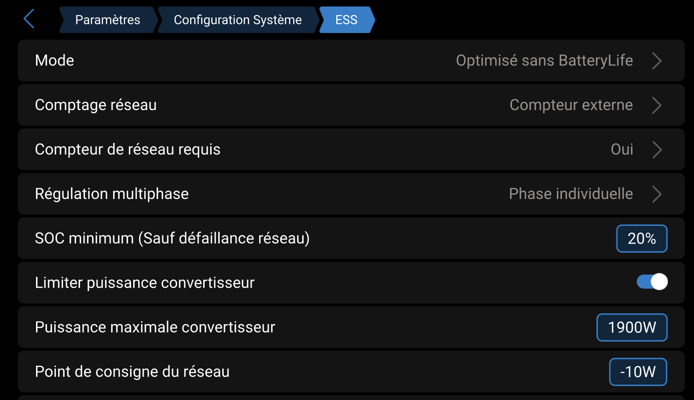
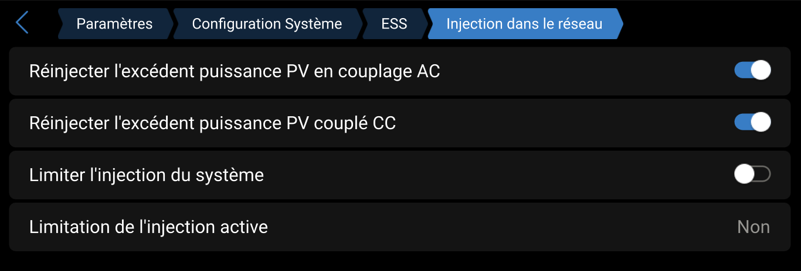
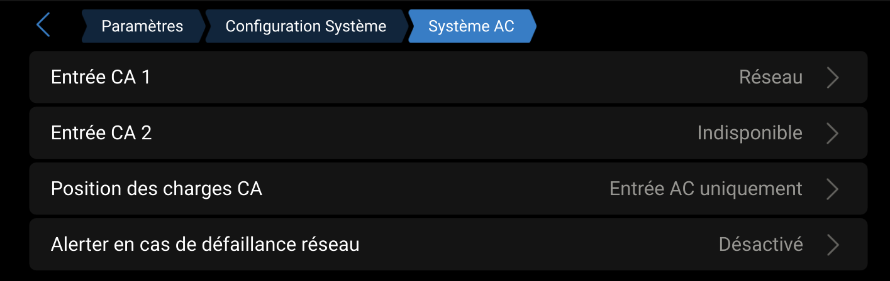
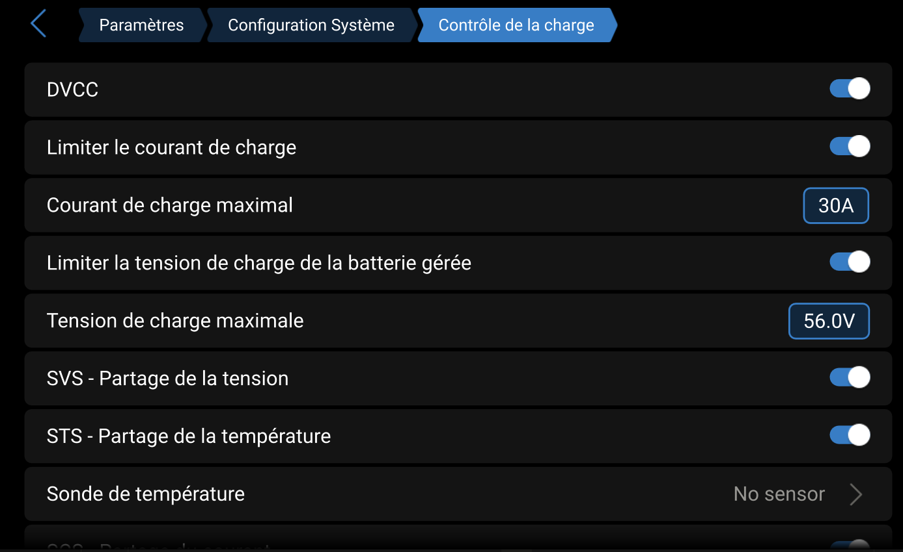
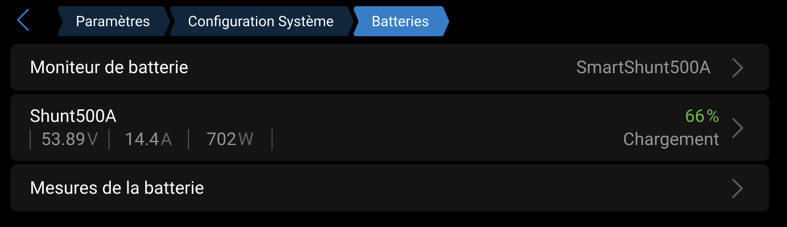

# VenusOS sur Raspberry Pi 4 – Configuration ESS

## Présentation

Ce document décrit la configuration de mon système **VenusOS sur Raspberry Pi 4B (4 Go)**.

Cette configuration est basée sur une installation réelle.
Elle est adaptée à mon installation personnelle et n'engage que moi.

Chacun est libre de l'adapter selon ses besoins.

⚠️ Respecter les règles de sécurité électrique.

---

## Matériel

- Raspberry Pi 4B – 4 Go RAM
- Carte SD 64 Go
- Alimentation officielle
- Réseau Ethernet recommandé
- Ecran 7'' Tactile

---

## Image installée

**VenusOS Large Image**

Avantages :

- Node-RED intégré
- MQTT intégré
- SSH activable
- Compatible extensions
- Idéal ESS personnalisé

---

## Services activés

### VRM

Menu:

Settings → VRM Online Portal

Activé:

- VRM Portal = ON

Permet:

- Supervision distante
- Console distante
- Historique

---

### MQTT local

Menu:

Settings → Services → MQTT on LAN

Configuration:

- MQTT = ON
- Authentification = ON

Utilisation:

- Node-RED
- ESP32 Victron
- dbus-mqtt-devices

---

### Node-RED

Menu:

Settings → Services → Node-RED

Configuration:

- Node-RED = ON

Utilisation:

- Smart Meter virtuel
- Shelly Pro 3EM
- Shelly Uni
- Virtual devices

---

### SSH

Menu:

Settings → Services → SSH

Configuration:

- SSH = ON

Connexion:

ssh root@IP_VENUSOS

Utilisation:

- Installation extensions
- Maintenance
- Debug

---

## Extensions installées

Installation via SSH (PuTTY).

### dbus-mqtt-devices

https://github.com/freakent/dbus-mqtt-devices

Fonctions:

- Smart meter virtuel
- Grid meter
- Devices virtuels
- Intégration MQTT

---

### dbus-mqtt-solar-charger

https://github.com/mr-manuel/venus-os_dbus-mqtt-solar-charger

Deux instances:

- MPPT 100/20
- MPPT 100/30

Fonctions:

- Intégration MPPT MQTT
- Compatible ESS
- Compatible VRM

---

## Architecture ESS

ESP32 Victron Unified
    ↓ MQTT
VenusOS MQTT Broker
    ↓
dbus-mqtt-devices
dbus-mqtt-solar-charger (x2)
    ↓
DBUS VenusOS
    ↓
ESS
    ↓
MultiPlus-II
    ↓
Grid

---

## Fonctionnalités

Cette configuration permet:

- ESS fonctionnel sur Raspberry Pi
- SmartShunt intégré
- MPPT intégrés
- Shelly Pro 3EM intégré
- Smart Meter virtuel
- VRM fonctionnel
- MQTT local
- Node-RED avancé

---

## Mode de fonctionnement

- ESS piloté par Smart Meter
- Charge uniquement sur surplus solaire
- Pas de charge volontaire depuis le Grid
- ESS stable

---

## Screenshots

## Params Ess:

## Params Ess Injection:

## Params SystemAC:

## Params DVCC:

## Params Batteries:

---

## Notes

Cette configuration:

- Est adaptée à mon installation
- Est fournie à titre informatif
- Peut nécessiter des adaptations

Chaque installation:

- Est différente
- Doit être validée électriquement
