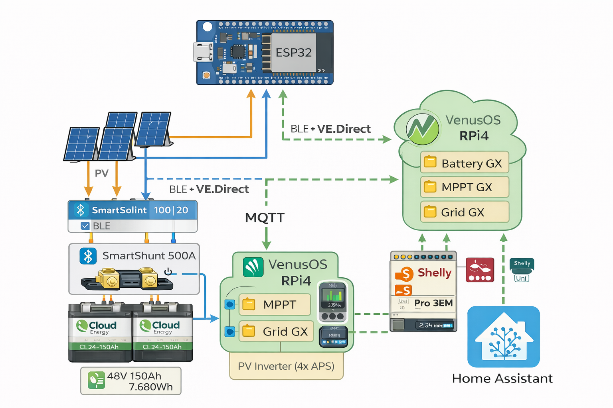

# Victron VenusOS DIY Integration

# Victron VenusOS DIY Integration (ESP32 + MQTT)

## Introduction

Projet d’intégration **GX-like pour Venus OS** basé sur **ESP32 + ESPHome + MQTT**, permettant
d'utiliser des équipements Victron **sans Cerbo GX**.

Le système permet de créer :

- Batterie GX virtuelle (SmartShunt)
- MPPT GX virtuels (BLE + VE.Direct)
- Smart Meter GX-like (Shelly)
- ESS MultiPlus-II supervisé 48-3000-35
- Automatisations Home Assistant

Compatible VenusOS **3.70+**

Mon Besoin : 
N'ayant pas de gros besoin, compteur 6kva maison BBC chauffage bois thermodynamique talon 250W jour 150 Nuit, pic Max a 4Kw , Routeur MsunPV Charge Boost Thermo + Radiateur Acova Salon 1500w
Mon But dans un premier temps recharger sur le Surplus Uniquement, pouvoir mettre en Pause la charge ou la décharge , si trop de surplus laisser le Routeur Solaire faire son Travail.

Evolution a venir : 
RAS a ce jour

---

## Installation réelle (Configuration de référence)

Ce projet est utilisé en production sur une installation Victron complète.

### Système GX

- Venus OS **3.70**
- Raspberry Pi 4B **4 Go**
- Écran tactile officiel **7 pouces**
- MQTT activé
- VRM activé

---

### Batterie

Configuration batterie :

- 2 × Cloud Energy CLA24-150Ah (Bms-Non comunicant)
- Technologie LiFePO4
- Montage série → 48V
- Capacité totale : 150Ah
- Energie totale : 7680Wh

Mesure batterie :

- SmartShunt 500A
- 2 * Shelly Uni V1 (important le V1)
- BMS logiciel Node-Red 

---

### Onduleur ESS

- MultiPlus-II 48/3000/35
- Mode ESS actif
- Recharge uniquement sur surplus solaire
- SmartShunt utilisé comme référence batterie

Pilotage via :

- VenusOS
- Node-Red 
- Home Assistant

---

### MPPT Victron

- 2 × SmartSolar MPPT 100/20
- Esp32 Ve-diret-to-mqtt  (fallback Bluetooth)

Panneaux :

- 4 × Trina Solar Mono 420W ( expo pas terrible )

Puissance totale :

1680W

---

### Production solaire AC

Micro-onduleurs :

- 4 × APSystems DS3-H

Panneaux :

- 8 × Trina Solar Full Black Bifacial 500W

Puissance panneaux :

4000 Wc ( Expo Sud-Est Sud en 50/50 )

Puissance AC :

3200 W

---

### Smart Meter GX-like

Basé sur :

- Shelly Pro3EM
- Shelly Uni
- Node-RED

Fonctions :

- Mesure réseau
- Mesure production AC
- Injection stabilisée
- Compensation ESS

---

### Supervision

Partie du système pilotée par **Home Assistant**.

Fonctions :

- Routage solaire
- Automatisation batterie
- Pilotage ESS
- Chauffage solaire / Eau Chaude
- Monitoring batterie avancé

---

## Architecture

ESP32 → MQTT → VenusOS → VRM

Home Assistant → Automatisations ESS

---

## Contenu du projet

### EspHome_Ble_Vedirect_VenusOs

Interface Victron GX-like basée ESPHome.

Fonctions :

- BLE + VE.Direct redondant
- SmartShunt GX-compatible
- MPPT GX-compatible
- Historique journalier GX-like
- Keepalive VenusOS
- PortalID dynamique

---

### Shelly_VenusOs

Smart Meter GX-like.

Basé sur :

- Shelly Pro3EM
- Shelly Uni
- Node-RED

---

### Victron_Mp2

Configuration ESS MultiPlus-II.

Contient :

- Paramètres ESS
- Notes configuration
- Automatisations Home Assistant

---

## Dépendances VenusOS

### dbus-mqtt-devices

Virtual battery GX

https://github.com/freakent/dbus-mqtt-devices

---

### venus-os_dbus-mqtt-solar-charger

Virtual MPPT GX

https://github.com/mr-manuel/venus-os_dbus-mqtt-solar-charger

---

## Version

Victron Unified ESP32 :

v6.2

Compatible VenusOS 3.70
